# Franka Gym

A Gymnasium environment for Franka robot control, providing a flexible interface for reinforcement learning tasks.

## Features

- Task-based architecture for custom reward functions and termination conditions
- Simple joint position control interface
- Real-time control using Franka bindings
- Safety limits and collision detection
- Easy extension for custom robot tasks

## Architecture

The environment follows a task-based architecture that separates the robot control logic from the task-specific logic:


### Interaction Flow

The environment and task interact during environment steps as follows:

```mermaid
sequenceDiagram
    participant User
    participant FrankaBaseEnv
    participant FrankaTask
    participant Robot
    
    User->>FrankaBaseEnv: create(task=custom_task)
    FrankaBaseEnv->>FrankaTask: extend_observation_space()
    FrankaBaseEnv->>User: environment instance
    
    User->>FrankaBaseEnv: reset()
    FrankaBaseEnv->>Robot: move to home position
    FrankaBaseEnv->>FrankaTask: reset()
    FrankaTask-->>FrankaBaseEnv: initialize task
    FrankaBaseEnv->>FrankaTask: get_observation()
    FrankaBaseEnv->>FrankaTask: get_info()
    FrankaBaseEnv-->>User: observation, info
    
    User->>FrankaBaseEnv: step(action)
    FrankaBaseEnv->>Robot: execute action
    FrankaBaseEnv->>FrankaTask: get_observation()
    FrankaBaseEnv->>FrankaTask: get_info()
    FrankaBaseEnv->>FrankaTask: compute_reward()
    FrankaBaseEnv->>FrankaTask: is_terminated()
    FrankaBaseEnv->>FrankaTask: is_truncated()
    FrankaBaseEnv-->>User: observation, reward, terminated, truncated, info
```



## Installation

1. First, install the Franka bindings package:
```bash
cd python/franka_bindings
pip install -e .
```

2. Then install this package:
```bash
cd franka_gym
pip install -e .
```

## Usage

### Basic Usage with Custom Task

```python
import gymnasium as gym
import numpy as np
from franka_gym import FrankaBaseEnv, FrankaTask

# Create a custom task
class MyCustomTask(FrankaTask):
    def __init__(self):
        # Initialize task parameters
        pass
        
    def extend_observation_space(self, base_observation_space):
        # Extend the observation space with task-specific observations
        return base_observation_space
        
    def get_observation(self, base_observation, env):
        # Add task-specific observations
        return base_observation
        
    def compute_reward(self, observation, action, info, env):
        # Compute task-specific reward
        return 0.0
        
    def is_terminated(self, observation, info, env):
        # Determine if episode should end
        return False
        
    def reset(self, env):
        # Reset task state
        pass
        
    def get_info(self, observation, env):
        # Provide task-specific info
        return {}

# Create the task
my_task = MyCustomTask()

# Create the environment with your custom task
env = gym.make('FrankaBase-v0', task=my_task)

# Reset the environment
observation, info = env.reset()

# Run a step
action = env.action_space.sample()  # Your control action here
observation, reward, terminated, truncated, info = env.step(action)

# Close when done
env.close()
```

For a complete example, see `examples/custom_task_example.py` which implements a reaching task using the new task-based architecture.

## Included Example: Reaching Task

The repository includes an example reaching task implementation in `examples/custom_task_example.py`. This example shows how to:

1. Create a custom task by implementing the `FrankaTask` interface
2. Define custom reward functions
3. Set custom termination conditions
4. Generate random targets
5. Run the environment with the custom task

## Environment Details

### FrankaBase-v0

A base environment for the Franka robot that can be configured with custom tasks.

- **Base Observation Space**: 
  - Joint positions (7)
  - Joint velocities (7)
  - Current end-effector pose (16 elements for 4x4 transformation matrix)

- **Task Extended Observation Space**:
  - Task-specific elements (depending on the task implementation)

- **Action Space**: 
  - Joint positions (7)

- **Reward**: 
  - Defined by the task implementation

- **Termination**:
  - Defined by the task implementation

## Creating Custom Tasks

To create a custom task:

1. Implement the `FrankaTask` interface by creating a class that inherits from it
2. Override the abstract methods to define your task's behavior
3. Pass an instance of your task to the environment constructor

The abstract methods you need to implement are:

- `extend_observation_space`: Define additional observation components
- `get_observation`: Generate the full observation
- `compute_reward`: Calculate the reward signal
- `is_terminated`: Determine when the episode is successfully completed
- `reset`: Initialize or reset task state (e.g., generate targets)

Optional methods you can override:

- `is_truncated`: Determine when to end an episode without success
- `get_info`: Provide additional information for debugging
- `close`: Clean up any resources

## Safety Features

- Joint position limits enforced
- Collision behavior settings
- Velocity and acceleration limits
- Timeout on motion commands 